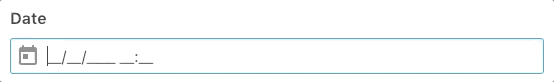

# vue-inputmask

Vue.js directive to add a mask to your inputs (vanilla javascript).

It's a binding for the inputmask library by Robin Herbots [https://github.com/RobinHerbots/Inputmask](https://github.com/RobinHerbots/Inputmask)



This library is licensed under MIT License.

# Install 
```bash
npm install -S vue-inputmask
```
# Setup

## With Typescript
```typescript
import Vue from 'vue'
const VueInputMask = require('vue-inputmask').default

Vue.use(VueInputMask)
```

## With a script tag
```html
<script src="./node_modules/inputmask/dist/inputmask/dependencyLibs/inputmask.dependencyLib.js"></script>
<script src="./node_modules/inputmask/dist/inputmask/inputmask.js"></script>
<script src="./dist/vue-inputmask-browser.js"></script>
```

# Usage
```html
<input type="text" v-mask="'99/99/9999'" />
<input type="text" v-mask="{mask: '99/99/9999', greedy: true}" />
```